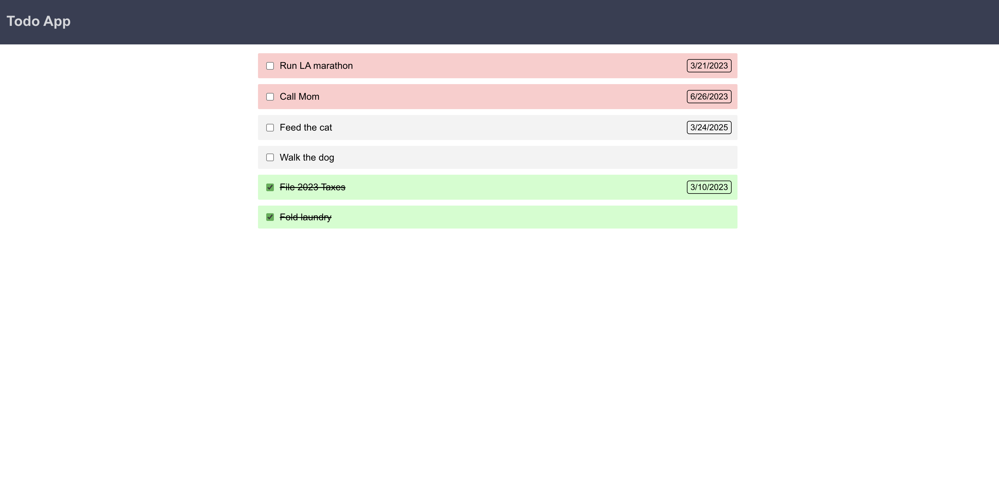
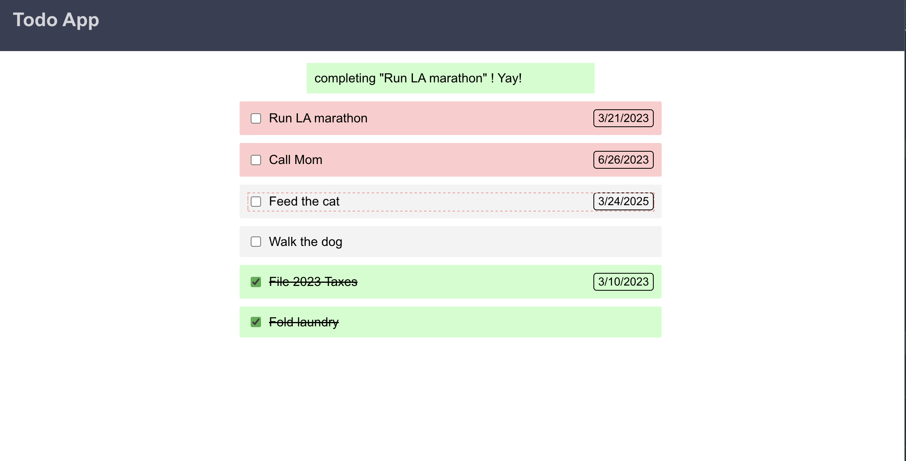
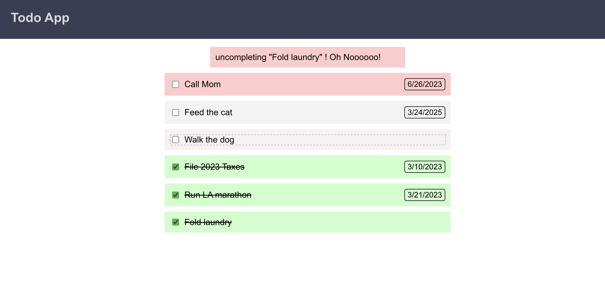

# Todo App

## Setup

1. Clone the repository:
   ```bash
   git clone https://github.com/your-repo/todo-app.git
   cd todo-app
   npm install
   ```

2. create a .env file in the root of the project and add the following:

REACT_APP_API_URL= (your api url here)
REACT_APP_API_KEY= (your api key here)

3.
```bash
    npm start
```
Open your browser and navigate to http://localhost:3000.

Future thoughts

Test a screen reader to see how it navigates elements
Test other visual updates
Allow adding/editing of todos
Make sure hard refresh doesn't undo updating todos
Theming changes should be more modular so we can apply global themes and change as needed. Also utilize system updates for dark theme by default if the user already has that set.


## Screenshots

### Main Page


### Task Completing


### Task Uncomplete


